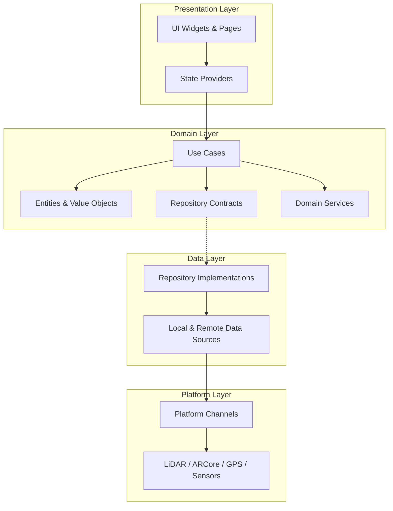
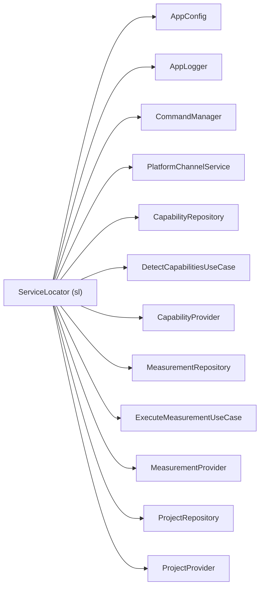
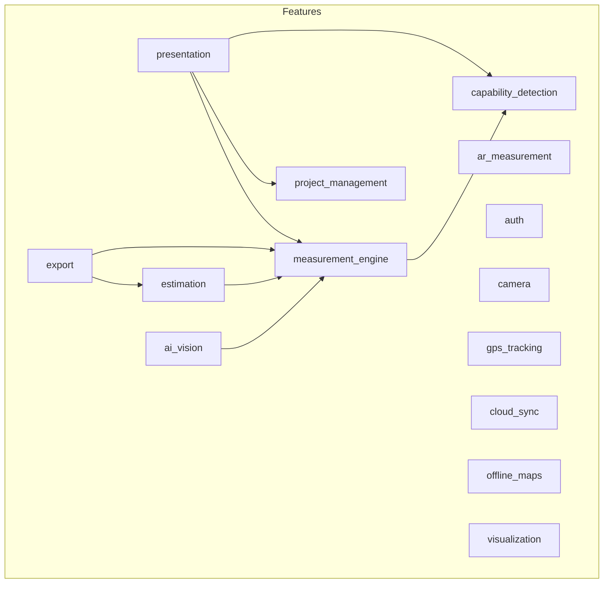
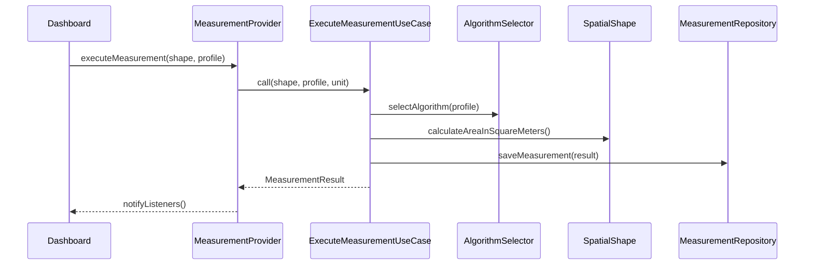

# Architecture

## Overview

GeoMeasure follows **Clean Architecture** with **feature-based modularisation**. Each feature is a self-contained module with its own domain, data, and presentation layers.

## Layer Responsibilities

| Layer | Responsibility | Dependencies |
|-------|---------------|-------------|
| **Presentation** | UI widgets, state management, user interaction | Domain |
| **Domain** | Business logic, entities, use cases, service contracts | None (pure Dart) |
| **Data** | Repository implementations, local/remote data sources | Domain contracts |
| **Platform** | Native SDK bridges, platform channels | Data layer |

## Dependency Injection

Manual service locator pattern in [`lib/core/di/service_locator.dart`](../lib/core/di/service_locator.dart).

**Initialisation order**: Core → Platform → Capability Detection → Measurement Engine → Project Management.

Global singleton: `final sl = ServiceLocator();` accessed throughout the app.

## Feature Modules

| Module | Purpose |
|--------|---------|
| `capability_detection` | Probes device sensors, returns normalised `CapabilityProfile` |
| `measurement_engine` | Shape geometry, algorithm selection, unit conversion, geodetics |
| `ai_vision` | Edge detection, object counting, photogrammetry, building analysis |
| `ar_measurement` | ARCore/ARKit measurement interface |
| `auth` | Firebase authentication service |
| `camera` | Image capture via `image_picker` |
| `gps_tracking` | Real-time GPS positioning via `geolocator` |
| `cloud_sync` | Remote data synchronisation |
| `offline_maps` | Map tile caching |
| `estimation` | Material estimation, quantity take-offs, cost estimates |
| `export` | PDF, Excel exporters; PDF report templates |
| `project_management` | Project CRUD, Hive persistence |
| `visualization` | Floor plan canvas rendering |
| `presentation` | Dashboard, history, GPS pages, shared widgets |

## State Management

ChangeNotifier-based providers, manually wired through `ServiceLocator`:

- `CapabilityProvider` — device capability state
- `MeasurementProvider` — measurement history and active result
- `ProjectProvider` — project list and active project

## Design Patterns

| Pattern | Usage |
|---------|-------|
| **Repository** | Abstract data access contracts in Domain, implementations in Data |
| **Use Case** | Single-responsibility business operations |
| **Command** | Undo/redo support via `CommandManager` with configurable stack depth |
| **Factory** | `VisionServiceFactory`, `MeasurementResult.fromShape()` |
| **Strategy** | `AlgorithmSelector` picks measurement algorithm based on capability profile |
| **Singleton** | `AppConfig`, `ServiceLocator` |

## Data Flow

