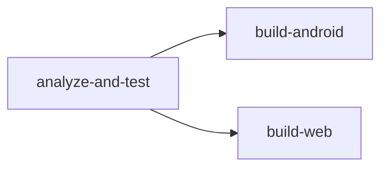

# Build & Deployment

## Local Development

```bash
# Install dependencies
flutter pub get

# Run tests
flutter test

# Run tests with coverage
flutter test --coverage

# Static analysis
flutter analyze

# Format code
dart format .

# Run app (debug)
flutter run

# Build web
flutter build web

# Build Android APK
flutter build apk --debug

# Build Android App Bundle
flutter build appbundle --release
```

## Docker

### Dockerfile

Multi-stage build based on `ghcr.io/cirrusci/flutter:3.22.0`:
- **Stage 1** (`flutter-base`): Installs Flutter, accepts Android licenses, pre-warms pub cache
- **Stage 2** (`builder`): Copies full source, runs tests by default

### Docker Compose Services

| Service | Command | Purpose |
|---------|---------|---------|
| `app-test` | `flutter test --coverage` | Run test suite |
| `app-analyze` | `flutter analyze` | Static analysis |
| `app-format` | `dart format --set-exit-if-changed .` | Format check |
| `app-build-web` | `flutter build web --release` | Web build |
| `app-build-apk` | `flutter build apk --debug` | Debug APK |
| `app-build-apk-release` | `flutter build apk --release` | Release APK |
| `app-build-aab` | `flutter build appbundle --release` | Play Store AAB |
| `app-ci` | Full pipeline | Analyze → Format → Test → Build |

```bash
# Run full CI pipeline locally
docker compose run --rm app-ci

# Build release APK
docker compose run --rm app-build-apk-release
```

## CI/CD — GitHub Actions

**File**: `.github/workflows/ci.yml`

**Triggers**: Push to `main`/`develop`, PRs to `main`.

### Pipeline Jobs



#### Job 1: `analyze-and-test`
1. Checkout code
2. Set up Flutter 3.22.0 stable
3. `flutter pub get`
4. `dart format --set-exit-if-changed .`
5. `flutter analyze`
6. `flutter test --coverage`
7. Upload coverage to Codecov
8. Secret scan (grep for hardcoded secrets)
9. Dependency audit (`flutter pub deps --no-dev`)

#### Job 2: `build-android` (depends on Job 1)
1. Set up Java 17 (Temurin)
2. Build debug APK and AAB
3. Upload artifacts to GitHub

#### Job 3: `build-web` (depends on Job 1)
1. Build release web app
2. Upload `build/web/` artifact

### Artifacts Produced

| Artifact | Path |
|----------|------|
| `geomeasure-android-apk` | `build/app/outputs/flutter-apk/app-debug.apk` |
| `geomeasure-android-aab` | `build/app/outputs/bundle/debug/app-debug.aab` |
| `geomeasure-web-dist` | `build/web/` |

## Platform Requirements

| Platform | Requirement |
|----------|------------|
| Android | SDK 24+ (Android 7.0), compileSdk 35 |
| iOS | iOS 12+, Xcode (macOS only) |
| Web | Modern browser with ES6 support |
| Flutter | ≥3.0.0 <4.0.0 |
| Dart | ≥3.0.0 |
| Java | 17 (for Android builds) |
