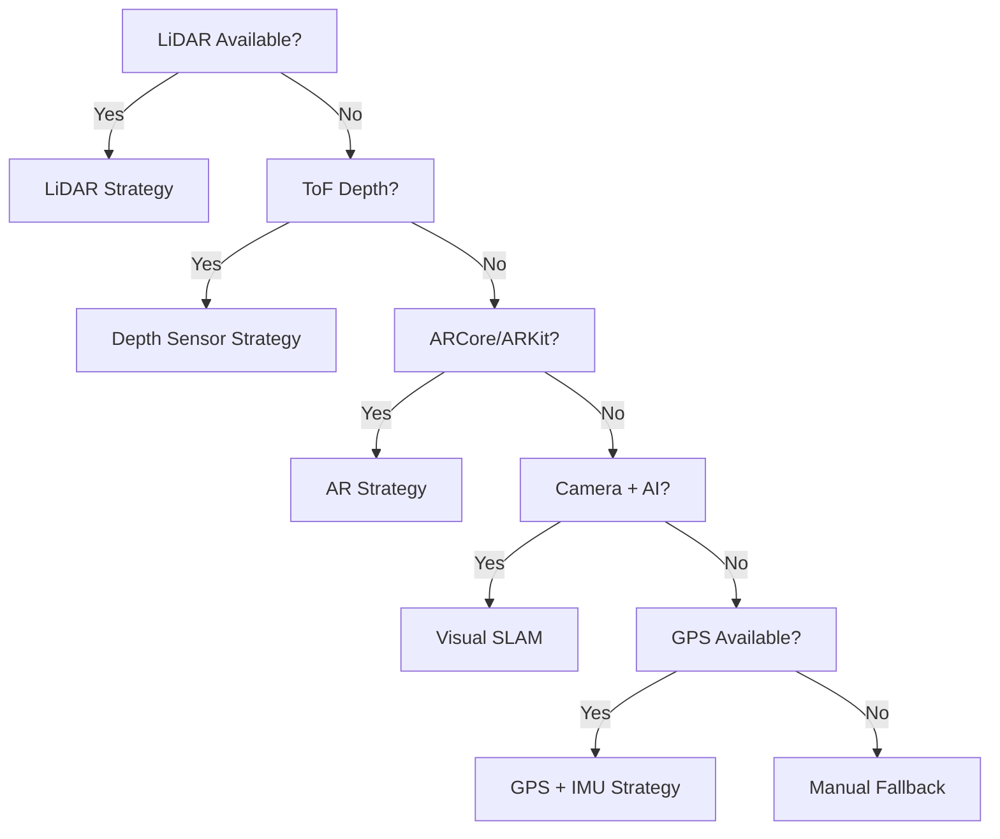

# Device Capabilities

## Probed Sensors & Hardware

| Sensor | Field | Detection Method |
|--------|-------|-----------------|
| LiDAR | `hasLidar` | Platform channel query |
| ToF Depth | `hasDepthSensor` | Platform channel query |
| ARCore/ARKit | `hasArCore` | Platform channel query |
| GPS | `hasGps` | Geolocator availability |
| Gyroscope | `hasGyroscope` | Platform sensor query |
| Accelerometer | `hasAccelerometer` | Platform sensor query |
| Magnetometer | `hasMagnetometer` | Platform sensor query |
| Barometer | `hasBarometer` | Platform sensor query |
| Camera | `cameraCount` | Platform channel query |

## Additional Probed Properties

| Property | Field | Purpose |
|----------|-------|---------|
| CPU Cores | `cpuCores` | Compute capability for AI/SLAM |
| RAM | `ramMb` | Memory budget for spatial mesh |
| OS Version | `osVersion` | Feature compatibility |
| Battery Level | `batteryLevel` | Thermal/power management |
| Thermal State | `thermalState` | Throttling decisions |

## Accuracy Classification

The `CapabilityProfile` assigns an overall accuracy classification:

| Classification | Criteria |
|---------------|---------|
| `high` | LiDAR or ToF depth sensor available |
| `medium` | ARCore/ARKit available |
| `low` | GPS + IMU only |
| `basic` | Manual input only |

## Fallback Hierarchy

## Implementation

- **Data source**: `HardwareCapabilityDataSourceImpl` in `capability_detection/data/datasources/`
- **Repository**: `CapabilityRepositoryImpl` wraps data source
- **Use case**: `DetectCapabilitiesUseCase` returns `CapabilityProfile`
- **Provider**: `CapabilityProvider` exposes state to UI
