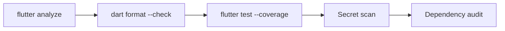

# Testing

## Current Status

| Metric | Value |
|--------|-------|
| Total tests | 226 |
| Pass rate | 100% |
| Test files | 3 |
| Analysis | 0 errors, 0 warnings |

## Test Types

### Unit Tests (`test/features/universal_platform_test.dart`)

209 tests covering all domain logic:

| Area | Tests | Description |
|------|-------|-------------|
| Shape geometry | 40+ | Area, perimeter, volume for all 25 shapes |
| Unit conversion | 12 | Distance and area unit conversion precision |
| Geodetic calc | 8 | Vincenty, Haversine, Shoelace |
| Algorithm selector | 4 | Strategy selection from capability profiles |
| Precision modes | 3 | Mode configs and accuracy ordering |
| MeasurementResult | 3 | Factory, serialisation, round-trip |
| Detected objects | 3 | BoundingBox IoU, DetectedObject serialisation |
| Object counter | 2 | Confidence filtering, density estimation |
| Building analysis | 3 | FAR, floor estimation, serialisation |
| Measurement validation | 3 | Quality grades, serialisation |
| Edge detector | 4 | Sobel, Harris, line detection, grayscale |
| Material estimation | 6 | Room estimation, wastage, cost calculation |
| T-Shape / U-Shape rooms | 6 | Area, volume, validation |
| JSON exporter | 3 | Single result, history, take-off |
| ExportManager JSON | 3 | Extension, MIME, supported formats |
| Vision service | 5 | LocalVisionService, factory |
| Excel exporter | 3 | Measurements, take-off, cost estimate |
| ExportManager Excel | 2 | Metadata, supported formats |
| Sensor fusion | 6 | GPS reading, multi-sensor, heading, reset, distance |
| Photogrammetry | 5 | Scale, distance, camera, surface area, FAST corners |

### Widget Tests (`test/features/presentation/pages/dashboard_page_test.dart`)

~50 tests for DashboardPage rendering: mode tabs, execute button, results display.

### Smoke Test (`test/widget_test.dart`)

App startup smoke test — verifies `GeoMeasureApp` mounts without errors.

## Test Commands

```bash
# Run all tests
flutter test

# Run with coverage
flutter test --coverage

# Run specific test file
flutter test test/features/universal_platform_test.dart

# Run tests matching a name
flutter test --name "SensorFusion"

# Docker
docker compose run --rm app-test
```

## Missing Tests

| Area | Priority | Notes |
|------|----------|-------|
| Integration tests | High | End-to-end measurement flows |
| PDF exporter output | Medium | Validate PDF byte structure |
| PDF report templates | Medium | Each of 5 templates |
| Auth service | Medium | Login/logout/session flows (requires mocking) |
| GPS tracking | Low | Requires location mocking |
| Camera service | Low | Requires platform channel mocking |

## Validation Pipeline



All steps run in CI via GitHub Actions on every push and PR.

## Coverage

Coverage reporting is available via `flutter test --coverage` which generates `coverage/lcov.info`. Currently uploaded to Codecov in CI but no minimum threshold is enforced.

**Recommendation**: Enforce 85%+ line coverage in CI.
